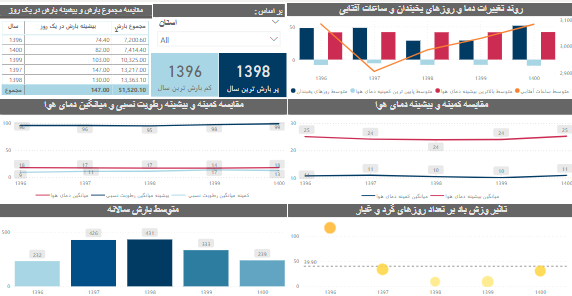
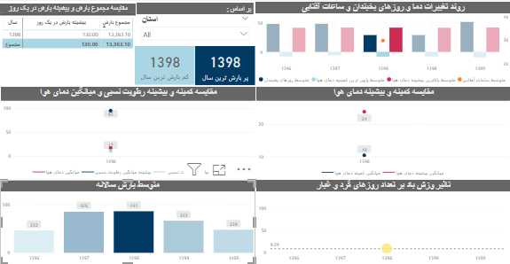
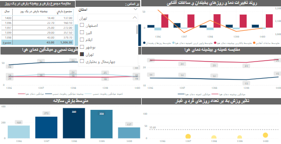
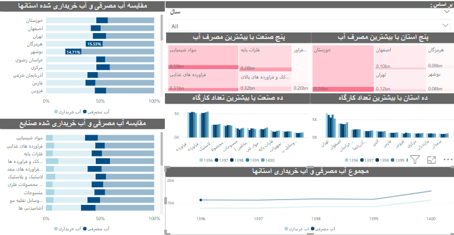
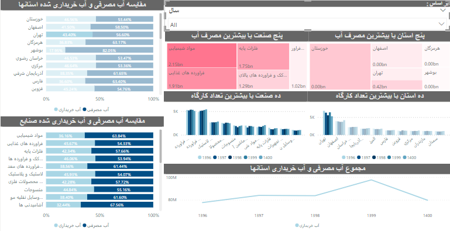
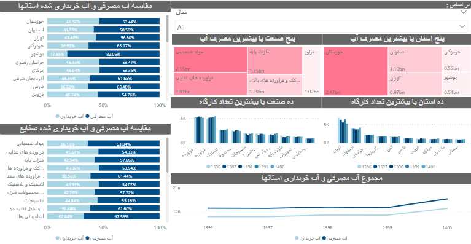

## عنوان

داشبورد تحلیلی میزان بارندگی و مصرف آب کارگاه های صنعتی کشور

### هدف پروژه

این داشبورد برای تحلیل داده های اب و هوایی و بارش استانها و میزان مصرف آب در استانها و صنایع مختلف طراحی شده است. هدف این پروژه شناسایی الگوهای مصرف آب و مقایسه مصرف در سالهای مختلف بین استانها و صنایع مختلف بوده است تا به تصمیم گیری دقیق تر در مورد مدیریت منابع آبی کمک کند.

### تحلیل داده ها

در این بخش، ابتدا به پاک‌سازی داده‌ها پرداخته شده است. این شامل حذف مقادیر تکراری، تبدیل مقادیر سال‌ها و تغییرات موردنیاز در نام‌گذاری ستون‌ها است. سپس تحلیل‌های اولیه داده، مانند بررسی الگوها و محاسبه آمارهای پایه‌ای (میانگین، بیشینه، کمینه و غیره) انجام شده است. پس از آن، مدل‌سازی داده‌ها و ایجاد Measureهای مختلف در Power BI با استفاده از DAX انجام شد. در نهایت، نمودارهای مختلفی برای تجسم داده‌ها و استفاده از فیلترها به‌منظور بررسی جزئیات ساخته شده‌اند.

### نتایج

نتایج شامل شناسایی بیشترین و کمترین مصرف آب در بازه‌های زمانی مختلف و مقایسه مصرف آب میان صنایع و استان‌ها بود. برای کمک به درک بهتر داده‌ها از نمودارهای مختلف مانند Treemap، Line Chart و Clustered Bar Chart استفاده شد. این نمودارها نشان‌دهنده توزیع و روند تغییرات مصرف آب هستند.

